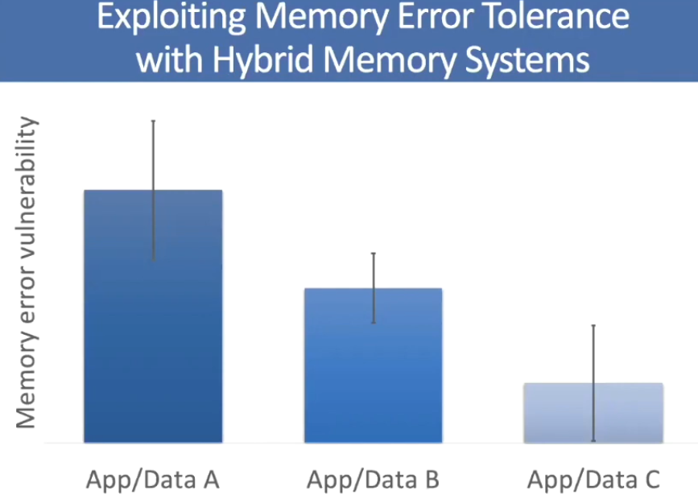
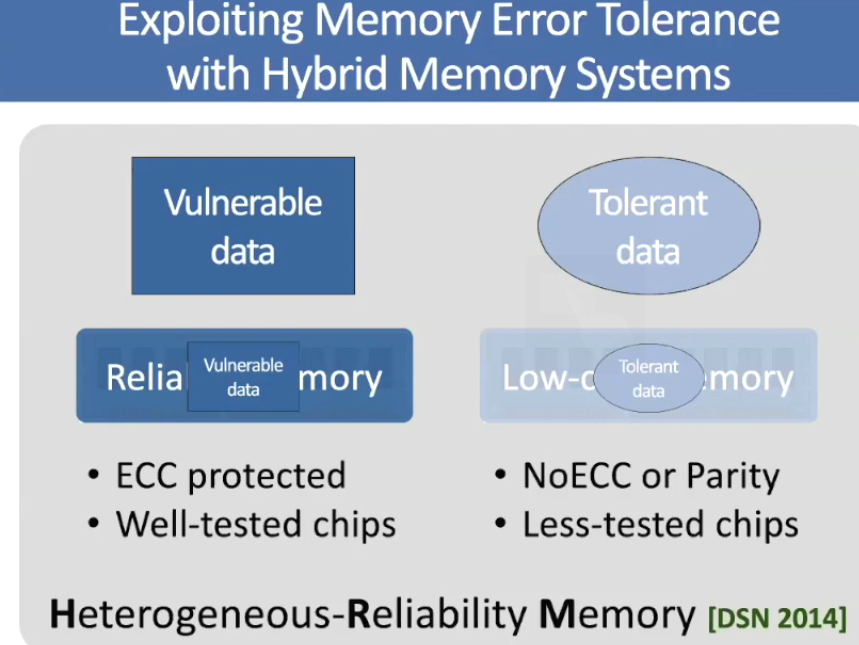
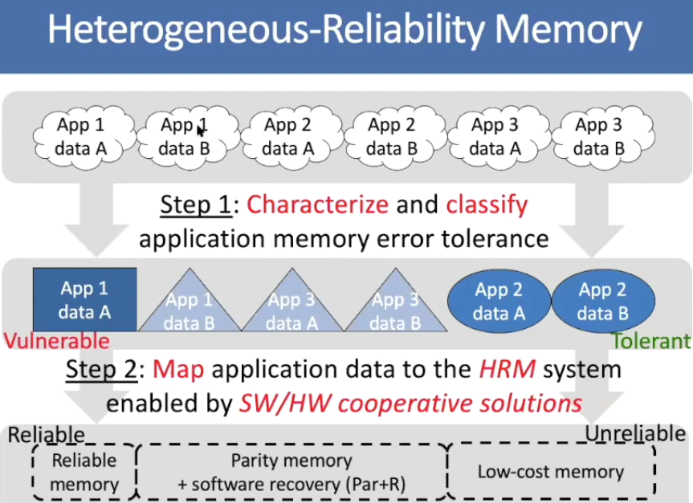

### Session 4

##### How to solve the memory problem?
1.	Make memory and memory controller more intelligent
    -	New interfaces, functions, architectures: System-Memory Co-design
    -	Like refreshing specific cells on an appropriate frequency
    -	Like memory-centric system design
2.	Replace and augment DRAM with a different technology
    -	New technologies and system-wide rethinking of memory and storage
3.	Design heterogeneous memories (DRAM + PCM) and map data intelligently across them
    -	New models for data management and maybe usage
    
**The Gist**: Solutions to this problem require **software/hardware/device** cooperation

Some applications + data are more robust to errors. So, is it logical to let them use just a single type of main memory like DRAM for all of them? So what about power efficiency? The following three images shows the idea.

 
**Another problem of memory systems**: Memory interference between cores is uncontrolled, which results in unfairness, starvation, low performance. Finally, we are going to have uncontrollable, unpredictable, vulnerable systems.

**Solution**: QoS-aware Memory Systems: like hardware designed to configure fairness by application aware scheduling, partitioning, throttling, and software designed to configure the resources to satisfy different QoS goals

***

**My Idea**: if we have a queue in which we keep the data requests to the DRAM, let’s count the number of requests and let the applications proportionate to the number of their request and also the priority of them be able to access to the DRAM. We can change the proportionate during time based on the behavior of the application.
***

In the beginning, memory controllers were separate chips from DRAMs, but AMD showed by integrating the latency decreases 3X, then Intel followed. However, separate controller chips can work with different types of main memories, even they can be replaced with better ones as they develop (More Scalability).

***